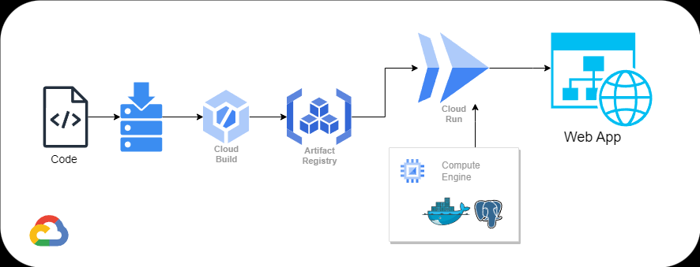

# Continuous Integration and Continuous Delivery (CI/CD) on GCP (Project)

### Architecture Diagram


    > DevOps: Plan -> Code -> Build -> Test -> Release -> Deploy -> Operate -> Monitor

---
## GCP Services
[Infrastructure Automation Services GCP](images/CI-CD-GCP-Services.drawio.png) 

* Custom VPC with three subnets -> App Network
* Static IP Address -> Database Static Ip Address
* Cloud Storage -> Store Startup Script 
* IAM Service Account  -> For Security
* IAM Custom Role -> For Security 
* Compute Engine -> Database Server
* Artifact Registry -> Store Container Image
* Cloud Build -> Build the image and submit to Artifact Registry
* Cloud Run -> Run the App
* Vertex AI Language Model -> Chat Language Model
* Source Repositories -> Version Control Management

---
### CI/CD Pipelines using GCP Services

Prerequisite
* GCP Account
* Project Owner IAM Role

```md
Source Control Management : GCP Source Repositories
Build and Test: Cloud Build
Release: GCP Artifact Registry
Deploy: Cloud Run 
Monitor: Cloud Operations Suite
```

```sh
# CI/CD Pipeline Automation
source environment-variables.sh
sh infrastructure-automation-gcp.sh && sh ci-cd-gcp.sh

# Clean Up
source environment-variables.sh
sh cleanup.sh
```

---
### CI/CD Pipelines using GCP Services and OSS

Prerequisite
* GCP Account
* Project Owner IAM Role

```sh
# CI/CD Pipeline Automation
cd ci-cd-oss
source ci-cd-env-oss.sh
sh ci-cd-infra-oss.sh && sh ci-cd-gcp-oss.sh

# Clean Up
source ci-cd-env-oss.sh
sh ci-cd-oss-cleanup.sh
```
---
### Resources
* GitHub Repository: https://github.com/mregojos/CI-CD-GCP
* App GitHub Repository: https://github.com/mregojos/model-deployment
* Infrastructure Automation on GCP GitHub Repository: https://github.com/mregojos/infrastructure-automation-gcp
* GitHub Repository Tech Stack for Cloud, DevOps, SRE: https://github.com/mregojos/tech-stack
* Google Cloud Documentation: https://cloud.google.com/docs

